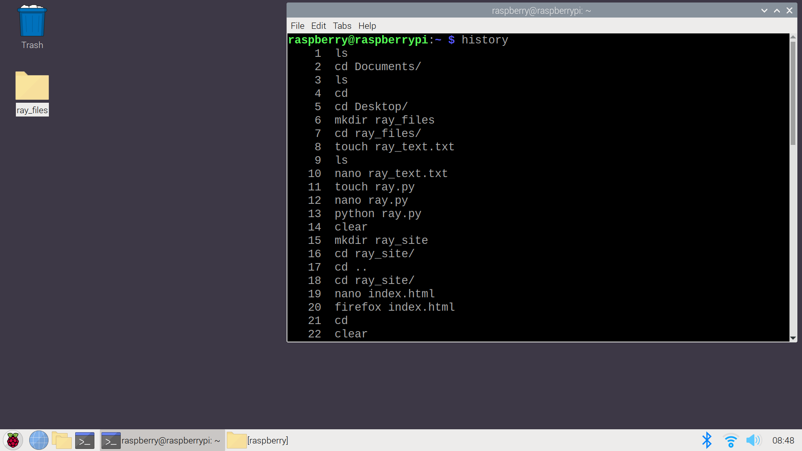

# Hosting and SSH 

The purpose of this section is to provide an opportunity for learners to:
- learn about servers and clients through locally hosting a website
- learn about IP address (IPv4, IPv6, DNS, static IP addresses...)
- experience headless access to a linux terminal through ssh
- run a single python http server and see the traffic coming to their website/server
- also it's fun for them to make a simple site that their classmates can pull up on their pi

## Outline
- [Basic HTML](#basic-html) 
- [Viewing the Site](#viewing-the-site)
- [Local Hosting](#local-hosting) using python http.server
- [Viewing Locally Hosted Sites](#viewing-locally-hosted-sites)  
- [Static IPv4 Address](#static-ipv4-address) on a raspberry pi
- [SSH Basics](#ssh-basics)
- [Edit and Host Site Headlessly](#edit-and-host-site-headlessly) using ssh, terminal and nano
- [History and Grading](#history-and-grading)

## Basic HTML
create a basic html site 

[Back to Outline](#outline)
## Viewing the Site
viewing the site

[Back to Outline](#outline)
## Local Hosting 
local hosting using python http.server

[Back to Outline](#outline)
## Viewing Locally Hosted Sites 
viewing locally hosted sites 

[Back to Outline](#outline)
## Static IPv4 Address 
setting a static IPv4 address on a raspberry pi

[Back to Outline](#outline)
## SSH Basics 
ssh basics

[Back to Outline](#outline)
## Edit and Host Site Headlessly 
edit and host html site using ssh, terminal and nano

[Back to Outline](#outline)
## History and Grading
Since students do not have access to the internet, submitting this assignment can be difficult.  
I usually grade this assignment by having students show me their edited site while I walk around and check off their names on a list.  
You could also have them show you their terminal command history by having them run the *history* command when they finish.  

[Back to Outline](#outline)

