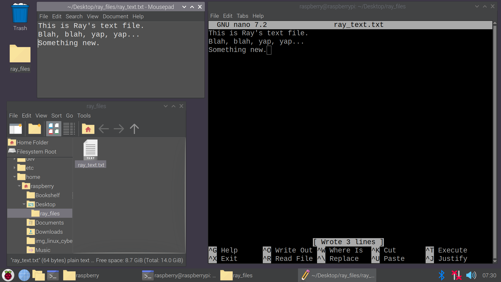

# Linux Basics and Nano

The purpose of this section is to provide an opportunity for learners to:
- play around with linux desktop by editing their preferences...
- begin using some basic terminal commands (ls, cd, mkdir, touch...)
- create a directory and files on the desktop using terminal commands
- use nano editor to edit .txt and .py files inside the terminal

## Outline 
- [Raspberry Pi setup](#raspberry-pi-setup) and intro to linux
- [basic terminal commands](#basic-terminal-commands) and directory navigation 
- [create a directory](#create-a-directory) and text file on desktop
- [intro to nano](#intro-to-nano)
- [edit text file in nano](#edit-text-file-in-nano) and save changes 
- [create a python file](#create-a-python-file)
- [edit python file in nano](#edit-python-file-in-nano)
- [run the python program from the terminal](#run-python-program-from-terminal)

## Raspberry Pi Setup
The first step that we take in this Linux/Cyber unit is to boot a raspberry pi linux desktop.  
It can take a few minutes to boot and setup the pis and some students will have more trouble with this than others.  
I let students know that they can change their desktop preferences in anyway they like.  This gives the students something to do while other students are getting theirs setup.  And I have found that all students like to change background images, fonts...

This is initial screen that comes up when they boot the desktop.  

This is my desktop after I change the preferences. (I show mine to my students.)

## Basic Terminal Commands
Once everyone has their pi running and are finished adjusting the preferences, I have them open a terminal window.  I spend some time explaining that the terminal how we control a computer without having to build a GUI or desktop.  And that if we access a computer remotely like a server, that the terminal is all we will have.  
(We do activity for remoting into their pis using ssh, so I let them know that they will need work using on the terminal very soon.)

It is important for their terminal to be sized so that it only covers half of the screen (the right half).  This lets them see directories and files appear on the desktop as they create them.  
With the terminal open, we go through a few basic commands for navigating the directories and files from the terminal. (If you are not familiar with linux commands, you can just search for they commands that are in my pictures to find more information.) 

ls, cd <*file or dir name*>, cd, cd .. (plus any other commands that you want to demonstrate)

[Back to Outline](#outline)
## Create a Directory 

Then I have them navigate to their Desktop directory.
Create a directory (*using mkdir*) on their desktop and cd into it.  
It will appear where they can see it on the desktop.  

Then I have them open their new directory by double clicking on the desktop folder, so they can see the effects of our terminal commands.  

Next, we use the *touch* command to create a text file in our directory.  
This shows them how to create a file and gives us the most basic file to edit in the nano editor.

They will see the text file appear in the desktop folder.
I also have them us the *ls* command to list the items in the directory from the terminal.  
This lets them see that the new file is visiable in terminal as well. 

[Back to Outline](#outline)
## Intro to Nano
Using the text file that they created, I show them how to use a text editor from the terminal.  
I use Nano in my classes.  VIM is a more professional terminal editor, but for my classes I keep it simple with nano.  

First, I have them open their text file in nano.  (using *nano file_name.txt*)
I point out that *nano* in this commands is running the nano program.

Once nano is open, I spend a lot of time explaining that we have "left the terminal" and are no in the nano editor just like opening VS Code or CodeHS Sandbox or any editor you use in class.  I also point out things that changed on the screen: the colors/theme, the header (File, Edit...), the footer (^G Help...)
Then we edit the file by adding some text.

[Back to Outline](#outline)
## Edit Text File in Nano

Saving changes in nano is the most confusing aspect for new users, so I spend a lot of time on this.
The footer of nano is basically the menu of options.  (^ strands for the control key)
Control+G will take you to a Help page, Control+X will exit nano an take you back to the terminal...

To save our changes, we need to "write" those changes to the file. 
So we use Control+O for Write Out.

After clicking Control+O, the footer changes and asks where we want to write our changes.
I explain to students this is similar to Save As on a windows computer. We can change the name of the file that we want to save our changes to, or if we want to save them to the current file we just press Enter.  
Just press Enter. 

After pressing Enter, nano lets us know how many lines were written to the file ("Wrote 2 Lines").  
Once the changes are saved ("written out" to the file), I have them open the file to see their changes from the desktop. 

Then, we edit the file by adding another line to the text and save using Control+O then Enter.  
After saving, we click on the text file again.  It gives us a pop up that something changed.  

We click Reload, and can see our changes.

[Back to Outline](#outline)
## Create a Python File
create a python file

[Back to Outline](#outline)
## Edit Python File in Nano
edit python file in nano

[Back to Outline](#outline)
## Run Python Program from Terminal
run the python program from the terminal

[Back to Outline](#outline)

